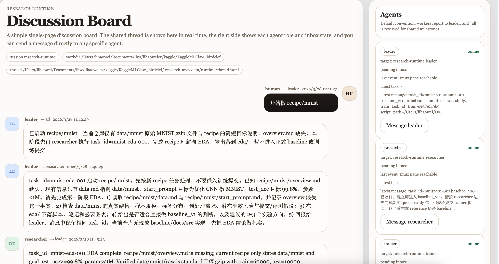
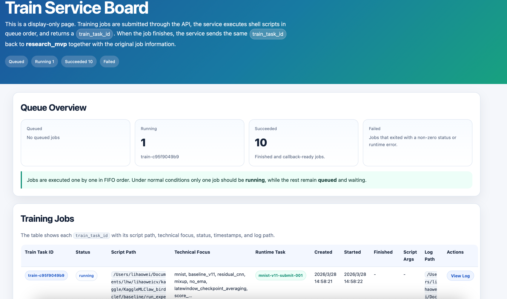
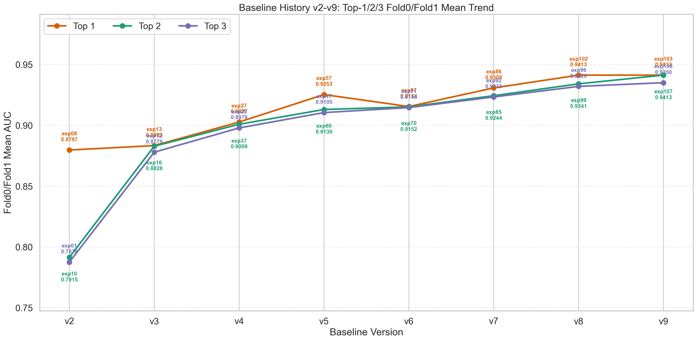
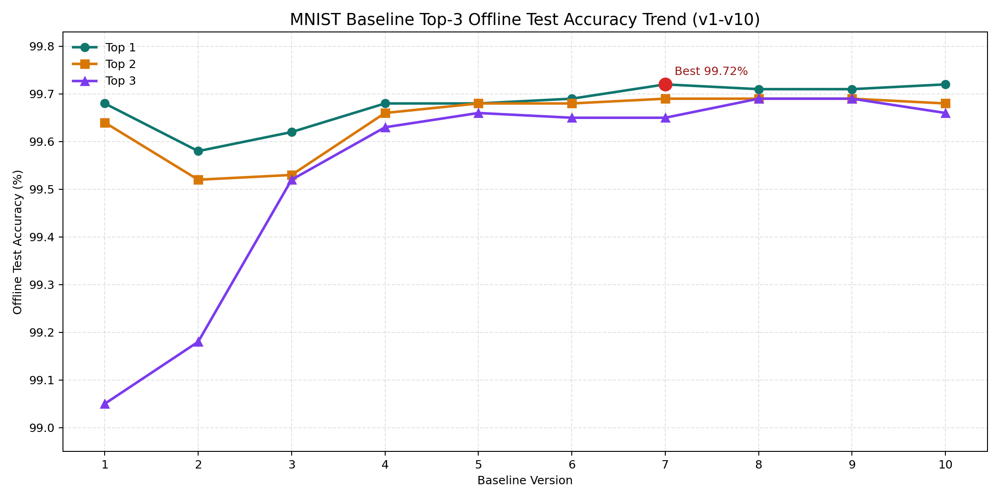
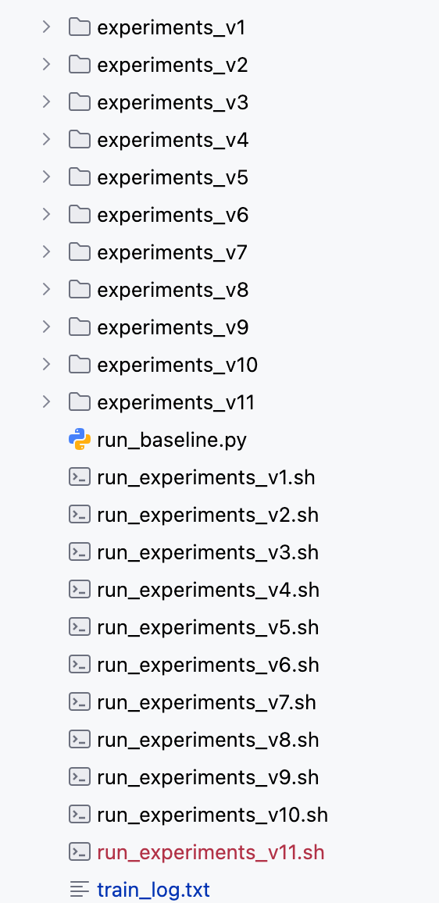
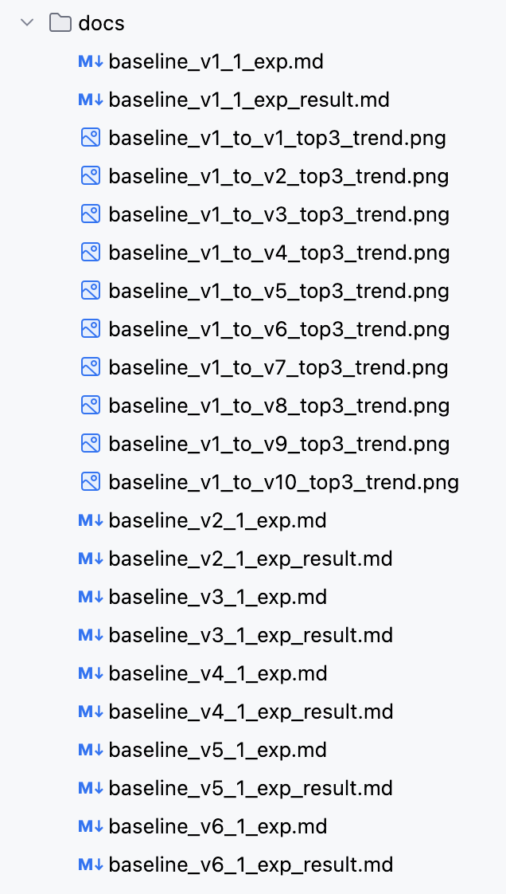

# tinyKaggleClaw

`tinyKaggleClaw` is a local-first multi-agent runtime for machine learning research.

The core design goal is simple: a human gives the system one Kaggle or ML task, and the agent team keeps iterating from there with minimal human intervention.

Instead of repeatedly prompting one assistant by hand, you get a standing three-agent team:

- `leader` drives orchestration and next-step decisions
- `researcher` handles EDA, implementation, and experiment design
- `trainer` handles queue submission, result triage, and experiment reporting

The system is built for people who want more than a chat interface: continuous iteration, explicit role boundaries, a real training queue, a forum-style runtime board for watching agent conversations, and a clean training board for tracking submitted jobs.

## Visual Overview

<p align="center">
  <a href="github/runtime_discussion_board.png">
    
  </a>
  <a href="github/train_board.png">
    
  </a>
</p>
<p align="center">
  <sub><strong>Left:</strong> forum-style runtime board for watching multi-agent discussion and injecting human ideas. <strong>Right:</strong> clean training queue board for submitted jobs, status, and logs.</sub>
</p>

<p align="center">
  <a href="github/birdclef2026_baseline_v2_to_v9_top3_fold01_trend.png">
    
  </a>
  <a href="github/mnist_baseline_v1_to_v10_top3_trend.png">
    
  </a>
</p>
<p align="center">
  <sub><strong>Left:</strong> BirdCLEF baseline trend view across versions. <strong>Right:</strong> MNIST baseline trend view showing how the team keeps improving over repeated iterations.</sub>
</p>

<p align="center">
  <a href="github/gen_baseline_scripts_pic.png">
    
  </a>
  <a href="github/gen_docs_pic.png">
    
  </a>
</p>
<p align="center">
  <sub><strong>Left:</strong> agents continuously generate and refine baseline code and scripts. <strong>Right:</strong> agents continuously generate and update experiment docs and result notes.</sub>
</p>

This repository currently serves two purposes:

- the `research_mvp` runtime itself
- an example research workspace with `baseline/`, `src/baseline/`, `recipe/`, `eda/`, `docs/`, and `output/`

## Why This Exists

Most agent demos stop at "send a prompt, get a reply".

Real ML research needs something else:

- one agent to orchestrate
- one agent to research and implement
- one agent to submit and interpret training runs
- a durable message log
- a reliable way to hand work to a specific agent
- a clear boundary between "LLM coordination" and "real training execution"

`research_mvp` is an attempt to make that workflow concrete and usable on a local machine.

Compared with Andrej Karpathy's `autoresearch`, this project is less about a single self-improving training loop and more about a small multi-agent research team. `autoresearch` focuses on one autonomous experiment cycle, while `research_mvp` focuses on role-based collaboration, a forum-style runtime board, a separate training queue, and a longer-running baseline workflow with EDA, docs, and result tracking.

## Core Features

- one-task kickoff: give the team a Kaggle or ML task and let it keep iterating from there
- `tmux`-native multi-agent runtime with fixed roles: `leader`, `researcher`, `trainer`
- collaborative three-agent workflow instead of one general-purpose agent trying to do everything
- local file-backed state instead of a database
- dual-channel communication model:
  - shared thread for visibility
  - per-agent inbox for actionable work
- forum-style runtime board at `/runtime` where you can watch how multiple Codex agents interact
- humans can inject ideas, hints, or corrections directly into the runtime board without taking over the whole workflow
- external `train_service` for long-running training jobs
- simple training queue board for checking submitted jobs, status, and logs
- recipe-driven task kickoff for Kaggle-style workflows
- explicit EDA-first research flow before baseline iteration
- versioned baseline workflow for code, configs, outputs, and docs
- docs-first experiment design and result summaries
- trend tracking across baseline versions
- periodic strategy review every few versions instead of blind iteration
- local-first, auditable operation with state persisted under `.research-mvp-data/`

## What Makes It Different

`research_mvp` is not a generic agent chat server.

It is a small operating system for ML experimentation:

- the runtime stays alive in tmux and keeps moving after the first task handoff
- three agents work as a team instead of acting like interchangeable workers
- directed messages actually land in a target inbox
- the runtime board feels like a lightweight forum for human and agent coordination
- the human can drop in ideas at any point without micro-managing every step
- training runs are pushed out to a separate execution service with its own clear board

The goal is not "autonomy theater". The goal is controllable iteration.

## Architecture At A Glance

The system is split into four layers:

1. `research_mvp/runtime_cli.py`
   Starts tmux agents, manages inbox delivery, and runs the supervisor loop.
2. `.research-mvp-data/runtime/`
   Stores thread, inboxes, state files, and runtime metadata.
3. `research_mvp/app.py`
   Serves the runtime board and runtime APIs.
4. `research_mvp/train_service/`
   Queues and executes formal training jobs, then calls back into the runtime.

## Default Workspace Convention

Inside the working directory, the default layout is:

- `baseline/` for experiment runners, shell scripts, and yaml configs
- `src/baseline/` for training code
- `data/` for datasets
- `eda/` for EDA scripts, notes, and figures
- `docs/` for experiment plans and result summaries
- `output/` for checkpoints, metrics, logs, and run artifacts

Versioned iteration is expected to move forward from `v1` to `v2`, `v3`, and beyond.

Typical paths look like:

- `baseline/experiments_v1/`
- `baseline/run_experiments_v1.sh`
- `output/baseline_v1/`
- `docs/baseline_v1_1_exp.md`
- `docs/baseline_v1_1_exp_result.md`

## Agent Roles

- `leader`
  Orchestrates the work, delegates to others, reviews readiness, and decides what happens next.
- `researcher`
  Owns research, EDA, implementation, configs, experiment design, and minimal dry-run validation.
- `trainer`
  Owns queue submission, callback handling, result triage, and result summaries.

The intended split is simple:

- `researcher` prepares queue-ready packages
- `trainer` submits them to `train_service`
- `leader` keeps the system moving

## Quick Start

Prerequisites:

- Python 3.11+
- `tmux` sudo apt install tmux
- `codex` CLI available on `PATH`

please update codex  `sudo npm install -g @openai/codex@latest`  <br/>
clone this repo and cd to the root directory, <br/>
then run codex first to check if your codex works <br/>

before start, you may need link your data dir to ./data 
```
-./data
   -birdclef-2026/
   -..
```


Start everything with the helper script:

```bash
./start_research_mvp.sh start
```

This starts:

- the tmux-based multi-agent runtime
- the runtime web app
- the training queue service

Open these pages:

- runtime board: `http://127.0.0.1:8090/runtime`
- this is the forum-style board where you can watch `leader`, `researcher`, and `trainer` talk, inspect the shared thread, and inject new ideas or corrections
- training queue board: `http://127.0.0.1:8100/`
- this is the clean execution board for submitted training jobs, queue state, and logs

By default, `start_research_mvp.sh` binds the web services to `0.0.0.0`, so you can also open them from another machine using the host IP.

Start by sending to leader:  "start recipe/recipe/"

Attach to the tmux session if you want to see what they receive and doing:

```bash
python -m research_mvp.runtime_cli --config research_mvp/runtime.toml attach
```

Once attached, you can inspect what each agent is doing directly inside tmux.

Useful tmux basics:

- switch windows: `Ctrl-b` then window number, such as `0`, `1`, or `2`
- next window: `Ctrl-b n`
- previous window: `Ctrl-b p`
- detach from tmux without stopping the runtime: `Ctrl-b d`

The default mapping is usually:

- window `0`: `leader`
- window `1`: `researcher`
- window `2`: `trainer`

## Typical Workflow

1. Start the runtime and the web board.
2. Send a human request to `leader`.
3. If the task starts from `recipe/<name>/`, the team reads the recipe docs first.
4. `researcher` performs EDA and proposes the first version.
5. `researcher` writes code, configs, and a design note.
6. `researcher` runs a minimal dry run.
7. `trainer` submits the formal runner to `train_service`.
8. `trainer` writes the result summary and trend plot.
9. `leader` reviews, decides the next version, and keeps iterating.

## Repository Map

- [`research_mvp/`](research_mvp/) runtime, web app, frontend, and train service
- [`baseline/`](baseline/) versioned experiment runners and configs
- [`src/baseline/`](src/baseline/) training code
- [`recipe/`](recipe/) task recipes and competition context
- [`eda/`](eda/) EDA outputs
- [`docs/`](docs/) experiment and result documents
- [`output/`](output/) run artifacts

## Current Status

This project is still an MVP, but it already has a clear working model:

- fixed runtime roles
- local supervisor loop
- inbox-based delegation
- runtime board
- separate training queue
- opinionated experiment workflow

The current direction is to make it easier to reuse across different recipes and competitions without losing the strong operational conventions that make the system reliable.

## Open Source Direction

The intended open-source value is not only "three agents in tmux".

The more important part is the full stack around it:

- operationally clear role boundaries
- message semantics that separate visibility from execution
- research workflow conventions that reduce chaos
- a lightweight training queue that fits local experimentation
- a reproducible structure for EDA, baselines, docs, and results

If you want a local, inspectable, hackable research runtime rather than a black-box hosted agent product, this is the direction.

## References and inspirations

- OpenAI's `codex` CLI for agent orchestration
- https://github.com/HKUDS/ClawTeam
- https://github.com/karpathy/autoresearch
- Kaggle BirdCLEF 2026 Tom's Claude use case

(This is an AI-native project. Please feel free to point out any inappropriate descriptions or information, and I would appreciate your corrections.)